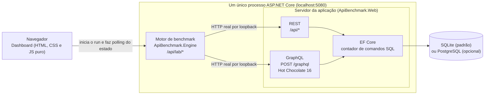

# API Performance Lab: REST vs GraphQL

Laboratório didático de Engenharia de Software. A **mesma base de dados** é exposta por uma API REST e por uma API GraphQL, e a própria aplicação **mede de verdade**, a cada execução, latência, volume de dados trafegado, número de requisições HTTP, número de consultas SQL, CPU e memória alocada. Nenhum número da interface é fixo: tudo vem de `/api/info` e `/api/lab/*`.

A conclusão esperada não é "X é melhor que Y". É mostrar que o resultado **depende do padrão de acesso aos dados** e entender o mecanismo por trás de cada diferença.

Vocabulário alinhado ao capítulo 8 do livro-texto (Tecnologias e Protocolos para Arquiteturas de Serviços): comunicação síncrona de requisição e resposta, REST como estilo arquitetural baseado em recursos (endereçabilidade, interface uniforme, ausência de estado), GraphQL como linguagem de consulta e mecanismo de execução com schema tipado, e os problemas de over-fetching e under-fetching.

## Sumário

1. [Pré-requisitos](#1-pré-requisitos)
2. [Como rodar](#2-como-rodar)
3. [Arquitetura](#3-arquitetura)
4. [Cenários](#4-cenários)
5. [Métricas e metodologia](#5-métricas-e-metodologia)
6. [Modo PostgreSQL opcional](#6-modo-postgresql-opcional)
7. [Limitações e ameaças à validade](#7-limitações-e-ameaças-à-validade)
8. [Estrutura de pastas](#8-estrutura-de-pastas)
9. [Referências do projeto](#9-referências-do-projeto)

## 1. Pré-requisitos

- **.NET 9 SDK** (`dotnet --version` deve mostrar `9.x`).
- Um navegador moderno. O dashboard é HTML, CSS e JavaScript puro, sem CDN, sem npm e sem etapa de build: funciona offline.
- Opcional, só para o [modo PostgreSQL](#6-modo-postgresql-opcional): Docker com Compose v2.

Desenvolvido e verificado em Windows. Deve funcionar em Linux e macOS com o .NET 9, mas isso não foi verificado.

## 2. Como rodar

Na raiz do repositório:

```bash
dotnet run -c Release --project src/ApiBenchmark.Web
```

Abra **http://localhost:5080**. O dashboard é servido em `/`; o IDE do Hot Chocolate (Nitro) abre em `/graphql` (botão "Abrir IDE GraphQL" no cabeçalho). A introspecção do GraphQL fica habilitada em qualquer ambiente, para o Nitro mostrar o schema e o autocompletar. Para encerrar, `Ctrl+C` no terminal.

O servidor procura `wwwroot` e `appsettings.json` na pasta atual, na pasta do executável e na pasta do projeto, nessa ordem; por isso rodar `ApiBenchmark.Web.dll` de outra pasta também serve o dashboard e grava o banco ao lado do projeto. Se `wwwroot/index.html` não for encontrado, o servidor avisa no console e só a API responde.

**Por que Release.** O modo Debug desliga otimizações do compilador JIT e acrescenta verificações, o que distorce justamente o que se quer medir. Rode sempre com `-c Release` e **sem depurador anexado** (F5 no Visual Studio anexa um). Feche aplicativos pesados e, em notebook, ligue na tomada.

**Primeira execução.** O servidor cria o banco `src/ApiBenchmark.Web/benchmark.db` (SQLite, ignorado pelo git) e o popula com um seed determinístico (`new Random(42)`): 20 categorias, 30 fornecedores, 500 produtos base, 200 clientes e, para cada cliente, de 3 a 6 pedidos com de 2 a 5 itens. Em seguida a aplicação completa a tabela de produtos até `Seed:Products` (padrão 100.000, `Random(4242)` independente, em lotes; cerca de 4 s no SQLite), sem alterar nada do restante do seed; num banco já existente com 500 produtos ela só insere os que faltam, e uma interrupção retoma do último lote. A faixa de ambiente no topo do dashboard mostra as contagens reais. Para recriar o banco, pare o servidor e apague `benchmark.db*`.

**Uso básico no dashboard.**

1. Escolha um cenário (seção 01) e leia "A tela precisa" e as requisições de cada variante.
2. Ajuste iterações, warm-up e concorrência (seção 02). Os valores padrão são 1.000, 50 e 1.
3. Clique em **EXECUTAR BENCHMARK**. Acompanhe cartões, comparativo, gráficos, trace das requisições e o texto de leitura gerado dos números medidos.
4. **Executar todos os cenários** roda os cinco em sequência e monta a matriz-resumo. O histórico guarda os últimos 20 runs em memória.
5. **Rede simulada** (seção 02): injeta, no cliente do laboratório, latência por requisição (0 a 1.000 ms) e/ou limite de banda (0,1 a 10.000 Mbps) para mostrar o custo de rede que o loopback esconde; é uma simulação, não vale no warm-up e a espera é precisa a menos de 1 ms. O botão **Varredura de rede** roda o cenário em 0, 20, 50 e 100 ms e desenha a mediana por latência, marcando onde uma variante passa a ganhar da outra, se houver.

Não mexa no navegador durante um run (não recarregue a página, não abra outra aba do dashboard): qualquer requisição extra entra nas métricas de SQL, CPU e alocação.

**Configuração opcional** (em `appsettings.json` ou na linha de comando, por exemplo `-- --Lab:BaseAddress=http://localhost:5080`):

| Chave | Padrão | Para que serve |
|---|---|---|
| `ConnectionStrings:Lab` | `Data Source=benchmark.db` | Arquivo SQLite (caminho relativo é resolvido a partir da pasta do projeto Web) |
| `Lab:BaseAddress` | descoberto do próprio servidor | Endereço que o motor usa para chamar o servidor; só defina se a descoberta automática falhar |
| `Seed:Products` | `100000` | Total de produtos (mínimo 500); completa o banco existente sem apagar nada |
| `Database:Provider` | `sqlite` | `sqlite` ou `postgres` (ver [seção 6](#6-modo-postgresql-opcional)) |
| `ConnectionStrings:LabPostgres` | `Host=localhost;Port=5433;Database=lab;Username=lab;Password=lab` | Conexão do modo PostgreSQL |

Verificação rápida sem o dashboard:

```bash
curl http://localhost:5080/api/info
curl http://localhost:5080/api/products/150
curl -X POST http://localhost:5080/graphql -H "Content-Type: application/json" \
  -d '{"query":"{ product(id: 150) { name price sku } }"}'
```

## 3. Arquitetura



- **Dashboard** (`wwwroot`): inicia runs, consulta o estado a cada cerca de 250 ms e desenha tudo a partir do JSON devolvido.
- **Motor** (`ApiBenchmark.Engine`): biblioteca que só conhece HTTP. Não referencia o projeto Web nem o EF Core. Faz chamadas HTTP reais por loopback com um único `HttpClient` (HTTP/1.1, keep-alive), na ordem e no formato de cada variante do cenário.
- **Servidor** (`ApiBenchmark.Web`): expõe REST (Minimal API, DTOs com projeção manual) e GraphQL (Hot Chocolate com projeções do EF Core e DataLoader) sobre o mesmo `LabDbContext`.
- **Contagem de SQL**: um interceptor do EF Core (`SqlCommandCounter`) conta todo comando executado; o motor lê o contador antes e depois de cada bloco.

Um run: o dashboard faz `POST /api/lab/runs` e recebe `202` com o `runId`; o motor executa em segundo plano (cold, warm-up, benchmark); o dashboard acompanha com `GET /api/lab/runs/{runId}`. Só um run executa por vez (`409` se houver outro).

## 4. Cenários

São cinco cenários que cobrem quatro padrões de acesso (o over-fetching aparece em versão item e em versão lista). Os identificadores são estáveis e definidos em `src/ApiBenchmark.Engine/Scenarios/ScenarioCatalog.cs`.

| Cenário (`id`) | A tela precisa de | Variantes | O que demonstra |
|---|---|---|---|
| `simple` | Todos os dados do produto 150 | `rest`: `GET /api/products/150`<br>`graphql`: `product(id: 150)` com todos os campos | O custo fixo do GraphQL (parse, validação e execução da query) quando o payload é equivalente |
| `overfetching` | Só nome, preço e SKU do produto 150 | `rest`: recurso inteiro<br>`graphql`: `{ name price sku }` | Over-fetching: bytes e campos recebidos mas não usados |
| `overfetching-list` | Nome, preço e SKU de 50 produtos | `rest`: `GET /api/products?take=50`<br>`graphql`: `products(take: 50)` com 3 campos | O mesmo desperdício multiplicado por 50 |
| `nested` | Cliente 15, seus pedidos, itens de cada pedido e produto de cada item | `rest`: 1+1+N requisições (opção "REST em paralelo")<br>`rest-bff`: `GET /api/customers/15/summary`<br>`graphql`: uma query aninhada | Under-fetching e custo de várias requisições; endpoint sob medida (BFF) contra query única; uma requisição HTTP não significa uma consulta SQL (o GraphQL faz 1 requisição e 3 consultas SQL) |
| `nplus1` | 50 pedidos com o nome do cliente de cada um | `rest`: `GET /api/orders?take=50`<br>`graphql-naive`: um SELECT por pedido<br>`graphql-dataloader`: SELECT em lote<br>`graphql-projection`: JOIN por projeção | N+1 no servidor: 51, 2 e 1 consultas SQL para o mesmo resultado na tela |

Pontos que ajudam a ler o cenário `nplus1`:

- As quatro variantes fazem **uma** requisição HTTP. A diferença está no número de consultas SQL por trás dela.
- `customerNaive` e `customerBatched` funcionam a partir de `recentOrders` (entidades sem projeção); o campo `customer` é o caminho de `orders` (com projeção).
- Contagens de SQL esperadas: `rest` 1, `graphql-naive` 51, `graphql-dataloader` 2, `graphql-projection` 1.

Contagens de SQL esperadas no `nested`: `rest` 7 (1+1+5 requisições para o cliente 15), `rest-bff` 1 e `graphql` 3. O GraphQL usa `AsSplitQuery` do EF Core: a mesma projeção automática vira uma consulta para o cliente, uma para os pedidos e uma para itens e produtos, em vez de uma única consulta com `LEFT JOIN` de subconsultas (que o SQLite executa de forma muito mais lenta, ver [seção 7](#7-limitações-e-ameaças-à-validade)).

A REST do laboratório é propositalmente "orientada a recursos": devolve o recurso inteiro. Isso é o que torna o over-fetching visível, e não uma falha da implementação. O endpoint `rest-bff` mostra o que um desenvolvedor REST faria para fugir do under-fetching (um endpoint por tela).

## 5. Métricas e metodologia

### O que é medido

| Métrica | Como é medida |
|---|---|
| Latência da operação | `Stopwatch` do início da 1ª requisição até o último byte do corpo da última requisição necessária para a tela. No `nested` REST inclui todas as 1+1+N requisições |
| Mediana, média, P95, P99, mín, máx, desvio-padrão | Sobre **todas** as amostras medidas (percentis por nearest-rank; desvio-padrão amostral). O gráfico mostra no máximo 2.000 pontos, mas as estatísticas não usam a versão reduzida |
| Cold run | 1 operação por variante, medida à parte, marcada se for a primeira execução daquela variante desde que o processo subiu. Antes do primeiro run do processo, o motor abre a conexão TCP e aquece o `HttpClient` com uma rota sem SQL (`GET /api/lab/scenarios`), fora das métricas; o cold ainda inclui o JIT, o modelo do EF e a inicialização do Hot Chocolate |
| Operações por segundo | Operações medidas dividido pelo tempo de parede somado dos blocos da variante |
| Requisições HTTP por operação | Contagem real de requisições feitas pelo motor |
| Bytes recebidos e enviados por operação | Recebidos: corpo da resposta, sem cabeçalhos. Enviados: linha de requisição mais corpo (a query GraphQL, com espaços colapsados, conta aqui) |
| Consultas SQL por operação | Diferença do contador do interceptor do EF Core entre o início e o fim de cada bloco |
| CPU por operação | Diferença de `Process.TotalProcessorTime` por bloco, dividida pelas operações. **Processo inteiro** (cliente, servidor e o que mais rodar nele) |
| Memória alocada por operação | Diferença de `GC.GetTotalAllocatedBytes` por bloco, dividida pelas operações. Também do processo inteiro |
| Campos JSON recebidos e usados | Folhas do JSON da operação de amostra contra um conjunto de caminhos que a tela de cada cenário usa (definido no catálogo de cenários) |
| Taxa de erro | Operação com status diferente de 2xx, com `errors` no corpo GraphQL ou com falha de transporte. Continua entrando na latência |

### Sequência de um run

1. **Cold run.** 1 operação por variante, em sequência. Fornece o trace, a resposta de amostra e a contagem de campos. Mostra o custo da primeira execução (JIT, conexões, caches), que não é o custo em regime.
2. **Warm-up.** Pelo menos `warmup` operações por variante, descartadas, com a mesma concorrência do run. Na primeira execução de cada variante desde que o processo subiu, o warm-up segue até completar no mínimo 1 s, porque o JIT em camadas ainda está promovendo o código quente (sem isso, o primeiro run do processo saía mais lento que os seguintes). `warmup = 0` pula a fase.
3. **Benchmark em blocos intercalados.** As `iterations` operações de cada variante são divididas em até 10 blocos. Dentro de um bloco só uma variante executa (com `concurrency` workers), e a ordem das variantes se inverte a cada bloco. Assim nenhuma variante fica sempre por último, e o ruído da máquina (outro processo, GC, variação de frequência da CPU) se distribui entre elas. Com `concurrency` maior que 1, cada bloco tem no mínimo 4 operações por worker (poucas iterações geram menos blocos), para a concorrência pedida ser alcançada; com menos iterações que workers, a concorrência efetiva é o número de iterações (a tela avisa). SQL, CPU e alocação são medidos por bloco e atribuídos à variante que o executou; num run cancelado, o bloco interrompido é descartado dessas três métricas (as operações abortadas em voo já gastaram recursos no servidor sem entrar na conta).

**JIT.** O processo roda com `TieredPGO` desligado e `System.Runtime.TieredCompilation.CallCountingDelayMs=0` (ver `ApiBenchmark.Web.csproj`). Com os padrões do .NET, o código quente demora muito a ser promovido para a camada otimizada, e as medições dos primeiros segundos saíam cerca de duas vezes mais lentas que o regime. Ainda assim, a primeira execução depois de subir o processo é a menos confiável; vale uma rodada de aquecimento antes de medir para valer.

Limites aceitos: `iterations` de 1 a 10.000, `warmup` de 0 a 1.000, `concurrency` de 1 a 32.

### Como ler

- Prefira a **mediana** à média e olhe P95 e P99 para a cauda.
- No comparativo, a razão (×) diz quantas vezes pior que o melhor. São exibidas como **empate técnico** as diferenças menores que 3% ou menores que 2 erros-padrão da variação medida no próprio run (o run é cortado em até 10 trechos consecutivos, calcula-se a estatística de cada trecho, e o erro-padrão relativo entre eles mede a dispersão, aquecimento e ruído da máquina inclusos). É uma regra de exibição da interface, não um teste estatístico, e não enxerga o ruído **entre** execuções: diferenças modestas (até algumas dezenas de por cento) podem inverter de um run para outro. O cold run, que é uma única amostra, nunca recebe selo de "melhor".
- Contagens (requisições, SQL, bytes, campos) são determinísticas e independentes da máquina. Tempos não são: mudam com a carga, a CPU e o momento. Repita o run antes de concluir algo com base em diferenças pequenas.
- A resolução da leitura de CPU no Windows é de cerca de 15,6 ms por leitura, então "CPU por operação" fica ruidosa com poucas iterações. Use 1.000 ou mais.

## 6. Modo PostgreSQL opcional

**Por que existe.** O SQLite roda dentro do próprio processo: cada consulta custa microssegundos e não há rede entre a aplicação e o banco. Isso torna o N+1 do cenário `nplus1` mais brando do que seria em produção. Com o PostgreSQL em um contêiner, o banco deixa de ser in-process e **cada consulta SQL passa a pagar uma ida e volta por TCP**, o que deixa o custo do N+1 mais realista.

**O que não muda.** Mesmo seed determinístico, mesmas rotas REST, mesmo schema GraphQL e mesmas contagens de SQL por cenário (por exemplo, 51, 2 e 1 no `nplus1`). Muda o custo de cada consulta, não a quantidade.

```bash
docker compose up -d
docker compose ps        # aguarde o estado "healthy"
dotnet run -c Release --project src/ApiBenchmark.Web -- --Database:Provider=postgres
```

- O `docker-compose.yml` sobe o serviço `postgres` (imagem `postgres:16-alpine`, contêiner `apilab-postgres`) na porta **5433** do host, exposta apenas em `127.0.0.1` (5432 dentro do contêiner; a diferença evita colisão com um PostgreSQL local), com `POSTGRES_DB=lab`, `POSTGRES_USER=lab`, `POSTGRES_PASSWORD=lab`, healthcheck com `pg_isready` e volume nomeado (`pgdata`). Essas credenciais são **só de laboratório local**; não as reutilize.
- Na primeira inicialização em modo PostgreSQL o servidor semeia o banco vazio com o mesmo seed.
- `GET /api/info` passa a trazer `databaseProvider` (`sqlite` ou `postgres`) e o dashboard mostra o banco em uso na faixa de ambiente do cabeçalho.
- Para voltar ao SQLite, suba o servidor sem o parâmetro (é o padrão).
- Encerrar: `docker compose down` (mantém o volume) ou `docker compose down -v` (apaga os dados; o próximo start semeia de novo).
- Não misture resultados de SQLite e PostgreSQL na mesma comparação, e registre qual banco estava ativo ao anotar números.

## 7. Limitações e ameaças à validade

Este é um experimento didático sobre **padrões de acesso**, não um benchmark de produção. Os valores absolutos de tempo valem para esta máquina, esta configuração e este momento. As ameaças abaixo seguem a classificação usual de validade em estudos empíricos de Engenharia de Software.

**Construto (a medida representa o que se quer avaliar?)**

- **Loopback.** Cliente e servidor se falam por `localhost`: não há latência de rede, limite de banda nem TLS. O custo de várias requisições (`nested` REST) e o de bytes extras (over-fetching) fica **subestimado**. Em rede real, o efeito é maior, e isso favorece a variante com menos idas e menos bytes.
- **Transporte simplificado.** HTTP/1.1, sem compressão (gzip ou brotli) e sem cache HTTP. Com HTTP/2 o custo de várias requisições cairia; com compressão, a diferença de bytes diminuiria. O cache HTTP, que é uma vantagem prática do REST (recursos endereçáveis por URI), não é exercitado.
- **Definição de "campo usado".** O conjunto de caminhos que a tela usa em cada cenário é decisão do autor, escrita à mão.
- **Latência do motor, não do usuário.** Mede-se até o último byte lido pelo motor, sem parse em objetos nem renderização. Clientes GraphQL reais costumam acrescentar custo no cliente.
- **CPU e memória do processo inteiro.** Não separam cliente de servidor, nem REST de GraphQL: incluem o motor, o servidor, o polling do dashboard e qualquer requisição extra durante o run.
- **Contagem de SQL não é custo de SQL.** O contador diz quantos comandos foram executados, não quanto cada um custou.

**Interna (a diferença observada vem do fator estudado?)**

- **Mesmo processo, mesma máquina.** Motor e servidor competem por CPU, GC e thread pool. Warm-up, cold à parte e blocos intercalados com ordem alternada reduzem o viés, mas não o eliminam.
- **Implementações, não especificações.** O REST usa projeção manual para DTOs; o GraphQL usa projeção automática do Hot Chocolate sobre o EF Core. O SQL gerado difere. No `nested`, a projeção automática em uma única consulta gerava `LEFT JOIN` de subconsultas aninhadas que o SQLite materializa a cada execução (cerca de 5 ms, contra décimos de milissegundo das consultas correlacionadas), e por isso o GraphQL perdia até para o REST de 1+1+N, enquanto o `rest-bff` usa uma consulta LINQ escrita à mão que o EF traduz em junções planas. Isso é característica do SQL gerado e do planejador, não do protocolo GraphQL. O laboratório usa `AsSplitQuery` (3 consultas SQL em vez de 1), que remove o artefato no SQLite; no PostgreSQL a consulta única já era boa, então ali a divisão custa 3 idas e voltas. É uma lição sobre projeção automática de ORM e sobre a diferença entre requisições HTTP e consultas SQL.
- **Banco in-process.** No modo SQLite, o N+1 sai mais barato do que em produção (ver [seção 6](#6-modo-postgresql-opcional)).
- **Um run por vez, ambiente compartilhado.** Navegador, antivírus, modo de energia e outros processos interferem. Não use a máquina durante o run.
- **Linha quente.** Cada cenário consulta sempre o mesmo produto (150) ou cliente (15). Os dados ficam no cache de páginas do banco, o que favorece todas as variantes e esconde custos de cache miss e de E/S.

**Externa (o resultado generaliza?)**

- **Dados sintéticos e pequenos.** Seed determinístico com cerca de mil pedidos; textos e distribuições simples. Volumes, cardinalidades e índices reais mudam os planos de execução. Os únicos índices são os de chave estrangeira criados por convenção do EF Core.
- **Poucos cenários, só leitura.** Cinco cenários de consulta. Não há mutations, subscriptions, autenticação, autorização nem limites de profundidade ou de custo de query; `take` é limitado a 1.000 e `skip` a valores não negativos, igual ao REST, mas uma query aninhada profunda com 1.000 itens ainda pode ser cara (o Nitro permite derrubar o laboratório de propósito).
- **Uma pilha específica.** .NET 9, Hot Chocolate 16, EF Core 9, SQLite ou PostgreSQL. Outras implementações de GraphQL e de DataLoader podem se comportar diferente.
- **Uma máquina, um sistema operacional.**

**Conclusão (a análise estatística sustenta o que se afirma?)**

- Percentis são calculados sobre amostras de um único run; as amostras não são independentes (GC, frequência de CPU). Não há intervalo de confiança nem repetição automática de runs. A regra de empate técnico (3% ou a dispersão medida entre trechos do run) é heurística de exibição.
- Há validação por execução real (servidor rodando, `curl` e navegador), mas não há suíte automatizada de testes. A conformidade com o contrato técnico foi conferida manualmente.
- Conclusões razoáveis: ordens de grandeza e mecanismos (número de requisições, de SQL e de bytes). Conclusões frágeis: diferenças de poucos por cento em tempo e comparações entre máquinas.

## 8. Estrutura de pastas

```
GraphQL/
├── ApiBenchmarkLab.sln
├── README.md
├── ROTEIRO-SEMINARIO.md          # roteiro de apresentação (15 a 20 min)
├── docker-compose.yml            # PostgreSQL opcional
├── docs/
│   └── CONTRATO.md               # contrato técnico: rotas, JSON, schema, cenários, metodologia
└── src/
    ├── ApiBenchmark.Engine/      # motor de benchmark (cliente HTTP puro; não conhece EF nem o Web)
    │   ├── Scenarios/            # catálogo de cenários e variantes
    │   ├── Runner/               # serviço de runs, execução cold/warm-up/blocos, estado
    │   ├── Statistics/           # percentis e demais estatísticas
    │   ├── Fields/               # contagem de campos JSON recebidos e usados
    │   ├── Http/                 # contexto de operação (requisições, trace, bytes)
    │   ├── Endpoints/            # /api/lab/*
    │   ├── Infrastructure/       # descoberta do endereço do servidor, CPU e alocação
    │   └── Models/               # contratos JSON do motor
    └── ApiBenchmark.Web/         # servidor: dados, REST, GraphQL e dashboard
        ├── Program.cs
        ├── ContentRootResolver.cs # localiza wwwroot e appsettings.json, de qualquer pasta
        ├── Data/                 # entidades, LabDbContext, DatabaseSettings, seed, contador de SQL
        ├── Rest/                 # endpoints e DTOs
        ├── GraphQL/              # Query, tipos, extensões de Order, DataLoader
        └── wwwroot/              # index.html, css/ e js/ (dashboard sem dependências)
```

## 9. Referências do projeto

- [`docs/CONTRATO.md`](docs/CONTRATO.md): fonte única de verdade sobre rotas, formatos JSON, schema GraphQL, cenários e metodologia, incluindo as notas de implementação.
- [`ROTEIRO-SEMINARIO.md`](ROTEIRO-SEMINARIO.md): roteiro minuto a minuto da apresentação, com perguntas prováveis da banca, plano B e checklist.
- Livro-texto, capítulo 8 (Tecnologias e Protocolos para Arquiteturas de Serviços): REST, GraphQL, gRPC, Webhook e AMQP.
