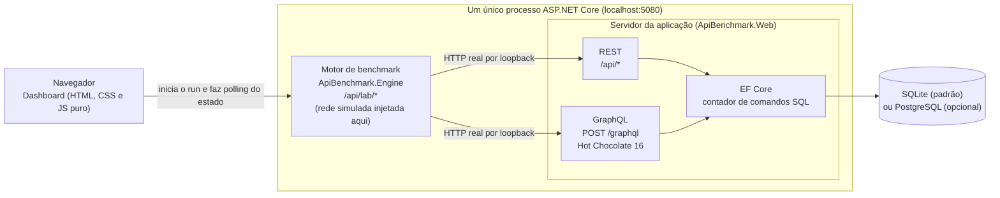

# API Performance Lab: REST vs GraphQL

Laboratório didático de Engenharia de Software. A **mesma base de dados** (inclusive 100.000 produtos) é exposta por uma API REST e por uma API GraphQL, e a própria aplicação **mede de verdade**, a cada execução, latência, volume de dados trafegado, número de requisições HTTP, número de consultas SQL, CPU e memória alocada. Como a medição acontece em loopback, onde a rede custa praticamente zero, o laboratório também pode **simular uma rede** (latência por requisição e banda limitada) e **varrer a latência** para mostrar como cada variante reage a ela. Nenhum número da interface é fixo: tudo vem de `/api/info` e `/api/lab/*`.

A conclusão esperada não é "X é melhor que Y". É mostrar que o resultado **depende do padrão de acesso aos dados** (e do custo da rede entre cliente e servidor) e entender o mecanismo por trás de cada diferença.

Vocabulário alinhado ao capítulo 8 do livro-texto (Tecnologias e Protocolos para Arquiteturas de Serviços): comunicação síncrona de requisição e resposta, REST como estilo arquitetural baseado em recursos (endereçabilidade, interface uniforme, ausência de estado), GraphQL como linguagem de consulta e mecanismo de execução com schema tipado, e os problemas de over-fetching e under-fetching.

## Sumário

1. [Pré-requisitos](#1-pré-requisitos)
2. [Como rodar](#2-como-rodar)
3. [Arquitetura](#3-arquitetura)
4. [Cenários](#4-cenários)
5. [Rede simulada e varredura de rede](#5-rede-simulada-e-varredura-de-rede)
6. [Métricas e metodologia](#6-métricas-e-metodologia)
7. [Modo PostgreSQL opcional](#7-modo-postgresql-opcional)
8. [Limitações e ameaças à validade](#8-limitações-e-ameaças-à-validade)
9. [Estrutura de pastas](#9-estrutura-de-pastas)
10. [Referências do projeto](#10-referências-do-projeto)

## 1. Pré-requisitos

- **.NET 9 SDK** (`dotnet --version` deve mostrar `9.x`).
- Um navegador moderno. O dashboard é HTML, CSS e JavaScript puro, sem CDN, sem npm e sem etapa de build: funciona offline.
- Memória livre para o cenário `volume`: o processo (servidor e motor juntos) chegou a 1,0 a 1,5 GB de working set com um cliente por vez e cresce com a concorrência (ver [seção 4](#4-cenários)).
- Opcional, só para o [modo PostgreSQL](#7-modo-postgresql-opcional): Docker com Compose v2.

Desenvolvido e verificado em Windows. Deve funcionar em Linux e macOS com o .NET 9, mas isso não foi verificado; em especial, o ramo do agendador da rede simulada que roda fora do Windows nunca foi executado numa máquina Linux ou macOS (ver [seção 5](#5-rede-simulada-e-varredura-de-rede)).

## 2. Como rodar

Na raiz do repositório:

```bash
dotnet run -c Release --project src/ApiBenchmark.Web
```

Abra **http://localhost:5080**. O dashboard é servido em `/`; o IDE do Hot Chocolate (Nitro) abre em `/graphql` (botão "Abrir IDE GraphQL" no cabeçalho). A introspecção do GraphQL fica habilitada em qualquer ambiente, para o Nitro mostrar o schema e o autocompletar. Para encerrar, `Ctrl+C` no terminal.

O servidor procura `wwwroot` e `appsettings.json` na pasta atual, na pasta do executável e na pasta do projeto, nessa ordem; por isso rodar `ApiBenchmark.Web.dll` de outra pasta também serve o dashboard e grava o banco ao lado do projeto. Se `wwwroot/index.html` não for encontrado, o servidor avisa no console e só a API responde.

**Por que Release.** O modo Debug desliga otimizações do compilador JIT e acrescenta verificações, o que distorce justamente o que se quer medir. Rode sempre com `-c Release` e **sem depurador anexado** (F5 no Visual Studio anexa um). Feche aplicativos pesados e, em notebook, ligue na tomada. Depois de subir o servidor, faça uma rodada de aquecimento (por exemplo, um "Executar todos os cenários" e um run curto com a rede simulada ligada) antes de medir para valer: a primeira execução depois de subir o processo é a menos confiável.

**Primeira execução.** O servidor cria o banco `src/ApiBenchmark.Web/benchmark.db` (SQLite, ignorado pelo git) e o popula com um seed determinístico (`new Random(42)`): 20 categorias, 30 fornecedores, 500 produtos base, 200 clientes e, para cada cliente, de 3 a 6 pedidos com de 2 a 5 itens. Em seguida a aplicação completa a tabela de produtos até `Seed:Products` (padrão **100.000**, `Random(4242)` independente, em lotes de 5.000; cerca de 4 s no SQLite, medido em build Debug), sem alterar nada do restante do seed: os 500 primeiros produtos e todas as outras tabelas são byte a byte os de sempre, então os cenários que existiam antes devolvem as mesmas respostas. Num banco já existente com 500 produtos ela só insere os que faltam, e uma interrupção retoma do último lote completo. A faixa de ambiente no topo do dashboard mostra as contagens reais (100.000 produtos, 200 clientes, 921 pedidos e 3.245 itens no seed padrão). Para recriar o banco, pare o servidor e apague `benchmark.db*`.

**Uso básico no dashboard.**

1. Escolha um cenário (seção 01) e leia "A tela precisa" e as requisições de cada variante.
2. Ajuste iterações, warm-up e concorrência (seção 02). Os valores gerais padrão são 1.000, 50 e 1; os cenários pesados (hoje o `volume`) trazem padrões e limites próprios, e a tela avisa quando eles assumem (ver [seção 4](#4-cenários)).
3. Opcional: ligue a **Rede simulada** (seção 02, com o selo SIMULAÇÃO): latência por requisição e/ou limite de banda. Com a rede ligada, cada operação passa a durar de dezenas a centenas de ms; reduza as iterações (a varredura usa no máximo 30 por etapa; o roteiro do seminário usa 30) ou o run demora minutos.
4. Clique em **EXECUTAR BENCHMARK**. Acompanhe cartões, comparativo, gráficos, trace das requisições e o texto de leitura gerado dos números medidos.
5. **Executar todos os cenários** roda os seis em sequência (respeitando os padrões e limites de cada cenário) e monta a matriz-resumo. O histórico guarda os últimos 20 runs em memória.
6. **Varredura de rede** roda o cenário escolhido em 0, 20, 50 e 100 ms de latência e desenha a mediana por latência (seção 03, que aparece depois da varredura). Detalhes na [seção 5](#5-rede-simulada-e-varredura-de-rede).

As seções do dashboard são: 01 Cenário, 02 Configuração, 03 Varredura de rede, 04 Resultado ao vivo, 05 Comparativo, 06 Gráficos, 07 O que trafegou, 08 Leitura do resultado, 09 Histórico da sessão, 10 Matriz-resumo e 11 Glossário das métricas (recolhível, 19 verbetes; cada rótulo de métrica também tem uma dica curta ao passar o mouse).

Não mexa no navegador durante um run (não recarregue a página, não abra outra aba do dashboard): qualquer requisição extra entra nas métricas de SQL, CPU e alocação.

**Configuração opcional** (em `appsettings.json` ou na linha de comando, por exemplo `-- --Lab:BaseAddress=http://localhost:5080`):

| Chave | Padrão | Para que serve |
|---|---|---|
| `ConnectionStrings:Lab` | `Data Source=benchmark.db` | Arquivo SQLite (caminho relativo é resolvido a partir da pasta do projeto Web) |
| `Lab:BaseAddress` | descoberto do próprio servidor | Endereço que o motor usa para chamar o servidor; só defina se a descoberta automática falhar |
| `Seed:Products` | `100000` | Total de produtos (de 500 a 5.000.000; fora disso o servidor não sobe e explica o motivo); completa o banco existente sem apagar nada |
| `Database:Provider` | `sqlite` | `sqlite` ou `postgres` (ver [seção 7](#7-modo-postgresql-opcional)) |
| `ConnectionStrings:LabPostgres` | `Host=localhost;Port=5433;Database=lab;Username=lab;Password=lab` | Conexão do modo PostgreSQL |

Verificação rápida sem o dashboard:

```bash
curl http://localhost:5080/api/info
curl http://localhost:5080/api/products/150
curl -X POST http://localhost:5080/graphql -H "Content-Type: application/json" \
  -d '{"query":"{ product(id: 150) { name price sku } }"}'
```

O motor também tem API própria (`POST /api/lab/runs`, `GET /api/lab/runs/{runId}`, ver [`docs/CONTRATO.md`](docs/CONTRATO.md)). Exemplo de um run do `nested` com 50 ms de rede simulada:

```bash
curl -X POST http://localhost:5080/api/lab/runs -H "Content-Type: application/json" \
  -d '{"scenarioId":"nested","iterations":30,"warmup":10,"simulatedLatencyMs":50}'
```

## 3. Arquitetura



- **Dashboard** (`wwwroot`): inicia runs, consulta o estado a cada cerca de 250 ms e desenha tudo a partir do JSON devolvido.
- **Motor** (`ApiBenchmark.Engine`): biblioteca que só conhece HTTP. Não referencia o projeto Web nem o EF Core. Faz chamadas HTTP reais por loopback com um único `HttpClient` (HTTP/1.1, keep-alive), na ordem e no formato de cada variante do cenário. É no motor, do lado do cliente, que a rede simulada espera a cada requisição.
- **Servidor** (`ApiBenchmark.Web`): expõe REST (Minimal API, DTOs com projeção manual) e GraphQL (Hot Chocolate com projeções do EF Core e DataLoader) sobre o mesmo `LabDbContext`.
- **Contagem de SQL**: um interceptor do EF Core (`SqlCommandCounter`) conta todo comando executado; o motor lê o contador antes e depois de cada bloco.

Um run: o dashboard faz `POST /api/lab/runs` e recebe `202` com o `runId`; o motor executa em segundo plano (cold, warm-up, benchmark); o dashboard acompanha com `GET /api/lab/runs/{runId}`. Só um run executa por vez (`409` se houver outro).

## 4. Cenários

São seis cenários que cobrem cinco padrões de acesso (o over-fetching aparece em versão item e em versão lista, e há um teste de estresse em volume). Os identificadores são estáveis e definidos em `src/ApiBenchmark.Engine/Scenarios/ScenarioCatalog.cs`, na ordem em que aparecem no dashboard.

| Cenário (`id`) | A tela precisa de | Variantes | O que demonstra |
|---|---|---|---|
| `simple` | Todos os dados do produto 150 | `rest`: `GET /api/products/150`<br>`graphql`: `product(id: 150)` com todos os campos | O custo fixo do GraphQL (parse, validação e execução da query) quando o payload é equivalente |
| `overfetching` | Só nome, preço e SKU do produto 150 | `rest`: recurso inteiro<br>`graphql`: `{ name price sku }` | Over-fetching: bytes e campos recebidos mas não usados |
| `overfetching-list` | Nome, preço e SKU de 50 produtos | `rest`: `GET /api/products?take=50`<br>`graphql`: `products(take: 50)` com 3 campos | O mesmo desperdício multiplicado por 50; com banda limitada, o tempo passa a acompanhar os bytes |
| `volume` | Nome, preço e SKU de cada um dos 100.000 produtos | `rest`: `GET /api/products?take=100000` (100 mil `ProductDto` completos)<br>`graphql`: `products(take: 100000)` com 3 campos<br>`graphql-full`: `products(take: 100000)` com todos os campos (inclusive `category` e `supplier`) | Teste de estresse: o custo de serializar e trafegar dezenas de MB e a pressão de memória. Em produção os dois lados paginariam |
| `nested` | Cliente 15, seus pedidos, itens de cada pedido e produto de cada item | `rest`: 1+1+N requisições (opção "REST em paralelo")<br>`rest-bff`: `GET /api/customers/15/summary`<br>`graphql`: uma query aninhada | Under-fetching e custo de várias requisições (a rede simulada o torna visível); endpoint sob medida (BFF) contra query única; uma requisição HTTP não significa uma consulta SQL (o GraphQL faz 1 requisição e 3 consultas SQL) |
| `nplus1` | 50 pedidos com o nome do cliente de cada um | `rest`: `GET /api/orders?take=50`<br>`graphql-naive`: um SELECT por pedido<br>`graphql-dataloader`: SELECT em lote<br>`graphql-projection`: JOIN por projeção | N+1 no servidor: 51, 2 e 1 consultas SQL para o mesmo resultado na tela |

Campos que a tela usa em cada cenário (base da métrica "campos usados"): `simple` usa todos; `overfetching`, `overfetching-list` e `volume` usam `name`, `price` e `sku`; `nested` usa o `name` do cliente, `date` e `total` do pedido, `name` e `price` do produto; `nplus1` usa `id`, `date` e `total` do pedido e o `name` do cliente.

**A base de 100.000 produtos.** Todos os cenários consultam a mesma base. Produto 150, `take=50` e os 50 primeiros pedidos continuam lendo poucas linhas (e devolvem exatamente as mesmas respostas de antes); só o `volume` lê a tabela inteira de produtos. A paginação é a mesma regra no REST e no GraphQL (`PagingRules`): `take` é ajustado, não rejeitado, para 0 a 100.000, e `skip` para valores não negativos. O ajuste vale para qualquer inteiro de 32 bits; fora disso (`take=3000000000`, `take=` vazio) o REST responde `400` e o GraphQL devolve erro de validação.

**O cenário `volume`.** É um teste de estresse deliberado, e a descrição na tela diz isso. Valores medidos (SQLite, build Release, esta máquina, uma consulta completa por vez; os tempos variam com a carga da máquina, então valem como ordem de grandeza):

| Variante | Corpo da resposta | Tempo de uma consulta completa (mediana) |
|---|---|---|
| `rest` | 83.550.652 B (cerca de 80 MB) | 3,5 a 3,7 s |
| `graphql` (3 campos) | 8.361.921 B (cerca de 8 MB) | cerca de 1,05 s |
| `graphql-full` (todos os campos) | 83.550.674 B | cerca de 6,0 s |

O `graphql-full` devolve o mesmo conteúdo do REST, campo a campo, nos 100 mil itens; os 22 B a mais são o envelope `{"data":{"products":...}}` da resposta GraphQL. Nas três variantes o run mede 1 requisição e 1 consulta SQL por operação e nenhum erro. Memória: o processo inteiro (servidor e motor) chegou a 1,0 GB no primeiro run e a 1,4 GB no seguinte, com um cliente por vez (o servidor sozinho, perto de 0,85 GB), e o servidor chegou a cerca de 3,5 GB com 8 clientes completos em paralelo. Por isso o cenário limita a concorrência a 2. Outros cuidados do motor com corpos desse tamanho: a resposta de amostra exibida na tela é só o trecho inicial (indentado e truncado em 4.000 caracteres, produzido sem indentar o corpo todo), a contagem de campos usa a resposta completa da operação de amostra, e o motor não retém os corpos das operações medidas além do necessário. Não combine o `volume` com banda limitada ao vivo: só transferir 83.550.652 B a 5 Mbps leva cerca de 134 s por operação (cálculo pela fórmula da [seção 5](#5-rede-simulada-e-varredura-de-rede), não medição). O mesmo cenário roda no [modo PostgreSQL](#7-modo-postgresql-opcional) (em uma medição de 1 iteração: `rest` 1,5 s, `graphql` 0,6 s e `graphql-full` 3,7 s).

**Padrões e limites por cenário.** `GET /api/lab/scenarios` informa, para cada cenário, `defaults` (iterações e warm-up sugeridos, ou `null`), `maxIterations` (ou `null`, vale o limite global de 10.000) e `maxConcurrency` (ou `null`, vale o limite global de 32). O `volume` usa `defaults = { iterations: 3, warmup: 0 }`, `maxIterations = 100` e `maxConcurrency = 2`. Os padrões foram escolhidos para um run completo durar cerca de 45 s ou menos: medido nesta máquina, 42 a 45 s (cold de 12 s mais 3 vezes a soma das três medianas); com warm-up 1 cada variante rodaria uma operação a mais, cerca de 11 s. Cronometre na sua máquina. Um `POST /api/lab/runs` que omite `iterations` ou `warmup` assume os padrões do cenário; com `iterations` ou `concurrency` acima do limite do cenário recebe `400 { "error": "..." }`. No dashboard, ao selecionar um cenário com `defaults`, os campos de iterações e warm-up assumem esses valores e a tela avisa ("Cenário pesado: sugerido 3 iterações, máximo 100; concorrência máxima 2."); ao sair do cenário volta a escolha geral do usuário; "Executar todos" respeita os padrões e limites de cada cenário; e a varredura de rede limita iterações e warm-up ao sugerido e ao máximo do cenário e a concorrência ao máximo dele. Com banda limitada num cenário pesado, a tela avisa que o run pode levar minutos e, havendo uma medição anterior, calcula o piso só da espera de transferência.

Pontos que ajudam a ler o cenário `nplus1`:

- As quatro variantes fazem **uma** requisição HTTP. A diferença está no número de consultas SQL por trás dela.
- `customerNaive` e `customerBatched` funcionam a partir de `recentOrders` (entidades sem projeção); o campo `customer` é o caminho de `orders` (com projeção).
- Contagens de SQL esperadas: `rest` 1, `graphql-naive` 51, `graphql-dataloader` 2, `graphql-projection` 1.

Contagens de SQL esperadas no `nested`: `rest` 7 (1+1+5 requisições para o cliente 15), `rest-bff` 1 e `graphql` 3. O GraphQL usa `AsSplitQuery` do EF Core: a mesma projeção automática vira uma consulta para o cliente, uma para os pedidos e uma para itens e produtos, em vez de uma única consulta com `LEFT JOIN` de subconsultas (que o SQLite executa de forma muito mais lenta, ver [seção 8](#8-limitações-e-ameaças-à-validade)).

A REST do laboratório é propositalmente "orientada a recursos": devolve o recurso inteiro. Isso é o que torna o over-fetching visível, e não uma falha da implementação. O endpoint `rest-bff` mostra o que um desenvolvedor REST faria para fugir do under-fetching (um endpoint por tela).

## 5. Rede simulada e varredura de rede

### Por que existe

O laboratório chama o servidor por loopback: cliente e servidor estão na mesma máquina, sem cabo, roteador nem distância. Nesse cenário uma ida e volta custa microssegundos e cada byte extra custa quase nada. Isso esconde justamente os dois custos que mais pesam numa rede real: **o número de idas e voltas** (REST com 7 requisições contra GraphQL com 1) e **o número de bytes** (over-fetching). Em loopback, as variantes ficam separadas por décimos de milissegundo a poucos milissegundos; com a rede simulada, a separação passa a ser de dezenas ou centenas de milissegundos. A rede simulada injeta, por requisição HTTP, o custo que uma rede real cobraria.

É uma **simulação**: o tráfego continua em loopback e o atraso é uma espera injetada no cliente do motor. A tela rotula isso (selo SIMULAÇÃO) e a linha-resumo da configuração repete o aviso.

### O modelo

Para cada requisição HTTP:

```
atraso = simulatedLatencyMs + (bytesEnviados + bytesRecebidos) × 8 ÷ (simulatedBandwidthMbps × 1.000.000) × 1000     [ms]
```

O segundo termo é o tempo de transferência e vale zero com banda sem limite. `bytesEnviados` é a linha de requisição mais o corpo enviado (a query GraphQL conta) e `bytesRecebidos` é o corpo da resposta (cabeçalhos HTTP não entram na conta).

| Campo (`POST /api/lab/runs`, opcionais) | Limites | Padrão | No dashboard |
|---|---|---|---|
| `simulatedLatencyMs` | inteiro de 0 a 1.000 | 0 | chips 0, 20, 50 e 100 ms, ou valor livre |
| `simulatedBandwidthMbps` | 0,1 a 10.000, ou `null` | `null` (sem limite) | chips Sem limite, 100, 20 e 5 Mbps, ou valor livre |

Valor fora dos limites devolve `400 { "error": "..." }`. Exemplo de conta de banda (medido, `overfetching-list`, 5 Mbps): o `rest` (41.883 B recebidos e 36 B enviados) paga 67,07 ms de transferência e o `graphql` (4.301 B e 77 B) paga 7,01 ms, exatamente o que a fórmula prevê. Na tela, a linha-resumo mostra quanto custam 100 KB na banda escolhida (a 5 Mbps, cerca de 164 ms).

### Como é injetada

- **Onde.** No cliente do motor (`src/ApiBenchmark.Engine/Http/OperationContext.cs`), depois do último byte do corpo da resposta e antes de a requisição ser considerada concluída. O instante de término da requisição é o do fim da espera, então o atraso entra em `latency`, `throughput` e no tempo do cold run: é o tempo que o usuário esperaria. O servidor não sabe da rede; ele já respondeu quando a espera começa.
- **Em paralelo.** A **latência** corre em paralelo: requisições simultâneas (REST em paralelo, concorrência maior que 1) esperam ao mesmo tempo, como numa rede real. A **banda** não: é um enlace único e compartilhado, então o tempo de transferência de uma requisição ocupa o enlace e as simultâneas esperam a vez, em vez de cada uma receber a banda inteira (e o atraso medido de cada uma inclui essa fila). Conferido: o `nested` com REST em paralelo, latência 0 e 5 Mbps move 15.158 B, que exigem pelo menos 24,3 ms nesse enlace, e a mediana medida foi de 29,5 ms (antes de a banda ser compartilhada saía 12,1 ms, abaixo do mínimo físico); o `overfetching-list` com concorrência 32 e 5 Mbps rendeu 14,9 operações/s do REST, cerca de 5,0 Mbps de dados, e não os cerca de 130 Mbps de antes.
- **Desligada.** Com latência 0 e banda sem limite, o motor nem cria a simulação nem o agendador: não há alocação, espera ou thread por requisição. Em sete rodadas A/B alternadas contra o motor anterior, medianas e throughput ficaram equivalentes dentro do ruído (cerca de 5 a 10%, nos dois sentidos).

### O que entra e o que não entra na medição

| Entra | Não entra |
|---|---|
| O atraso de cada requisição do **cold run** e do **benchmark**: aparece na latência (média, mediana, percentis), no throughput e no cold | O **warm-up**: ali a rede é ignorada, porque o aquecimento serve ao JIT e ao pool, e esperar rede só gastaria tempo |
| A soma dos atrasos por operação (`simulatedNetworkMsPerOperation`) e o atraso de cada requisição no trace (`simulatedDelayMs`) | Uma requisição com **falha de transporte** (sem resposta): não recebe atraso |
| Bytes enviados e recebidos de cada requisição, que definem o tempo de transferência com banda limitada | Cabeçalhos HTTP, que não são contados nos bytes e, portanto, não custam banda |
| | O tempo de giro do agendador de atrasos: é custo do simulador e é descontado de `cpuMsPerOperation` |
| | O `durationMs` do trace: continua sendo o tempo real da requisição, sem o atraso |

### Precisão

`Task.Delay` puro no Windows tem granularidade de cerca de 15 ms (medido: erro mediano de 8,6 a 12,1 ms), o que inviabiliza simular 20 ms. O motor usa um agendador dedicado (`PreciseDelayScheduler`): uma thread de prioridade alta com fila de prazos, que dorme com o temporizador de alta resolução do Windows até 1 ms antes do prazo e gira só o trecho final; esperas de até 100 µs giram na própria chamada. O valor reportado é o atraso **realmente** injetado, medido na thread do agendador. Medido no caminho real do motor (alvos de 20, 50 e 100 ms, concorrência 1 e 16): erro mediano de 0,001 a 0,005 ms, P99 de 0,08 a 0,31 ms e máximo de 0,82 ms, sem nenhuma amostra fora de ±1 ms. Sem o temporizador de alta resolução (Windows antigo) o agendador cai em uma espera com margem de giro maior, à custa de mais CPU; fora do Windows usa uma espera de ms comum, ramo que não foi executado numa máquina Linux ou macOS. Cancelar um run no meio de uma espera leva o run a `cancelled` em poucos ms.

### Efeitos colaterais que valem conhecer

- **Tempo real, CPU e memória sobem com a rede ligada.** Threads do ThreadPool, do Kestrel e de E/S acordam entre as esperas: medido no `nested`, cerca de 19 ms de CPU por operação com 50 ms contra cerca de 4,7 ms sem rede, e o tempo real de cada requisição sobe de 0,5 a 1,5 ms depois de uma espera. É efeito físico, não erro do atraso. Compare CPU, memória e tempo real **só entre runs com a mesma rede**.
- **Soma dos atrasos versus latência.** As requisições de uma operação vão em sequência (exceto no REST em paralelo), então os atrasos são aditivos: `mediana ≈ tempo real + soma injetada`, e o dashboard mostra "Tempo real medido = mediana − rede injetada". Isso vale com qualquer concorrência: ela sobrepõe operações diferentes, não as requisições de uma mesma operação (medido no `nested` sequencial a 50 ms: com concorrência 4, mediana de 366 ms para uma soma injetada de 350 ms). Só o **REST em paralelo** sobrepõe requisições da mesma operação, e apenas nas variantes que disparam mais de uma (a `rest` do `nested`): nelas a soma injetada passa a ser maior que o acréscimo real, o dashboard mostra só "Rede simulada (soma injetada)" com um aviso e **não** a subtrai da mediana; `rest-bff` e `graphql` do mesmo run continuam com "Tempo real medido".
- **Runs longos.** Com a rede ligada, o tempo de um run é aproximadamente iterações × soma das medianas das variantes. O `nested` a 50 ms, com 1.000 iterações, passaria de 7 minutos (1.000 × a soma das medianas do exemplo abaixo, cerca de 463 ms); use algumas dezenas de iterações. Com banda limitada o tempo tem um piso próprio: como o enlace é compartilhado, as transferências de todas as operações vão em série mesmo com concorrência alta (2.000 iterações do `overfetching-list` a 5 Mbps e concorrência 32 levaram 150 s).

### Exemplo de uma execução

Medido nesta máquina (Windows, SQLite, `nested`; medianas em ms). Os valores mudam a cada execução e a cada máquina:

| Rede | `rest` (7 requisições) | `rest-bff` (1) | `graphql` (1) |
|---|---|---|---|
| loopback | 3,6 | 0,7 | 1,1 |
| 50 ms por requisição | 359 | 51,6 | 52,0 |
| 50 ms, REST em paralelo | 154 | | |

Sequencial, o REST paga 7 × 50 ms de rede (soma injetada de cerca de 350 ms) mais o tempo real; BFF e GraphQL pagam 1 × 50 ms. Em paralelo, o REST cai para 3 "ondas" de espera (cliente, pedidos e os 5 itens juntos), mas continua 3 idas e voltas em cascata, não 1; requisições, SQL e bytes não mudam. Exemplo de banda, `overfetching-list`, 5 Mbps e latência 0: `rest` 68,7 ms (41.883 B recebidos) contra `graphql` 8,5 ms (4.301 B recebidos); a razão de tempo (cerca de 8 vezes) fica perto da razão de bytes (cerca de 10 vezes).

### Varredura de rede

O botão **Varredura de rede** executa o cenário selecionado em **0, 20, 50 e 100 ms** de latência (mantendo a banda escolhida), uma etapa por vez, e desenha a mediana de cada variante contra a latência. Cada etapa é um run próprio, com iterações = mínimo entre a escolha do usuário e 30 e warm-up = mínimo entre a escolha e 10 (e, em cenário pesado, também o `maxIterations` e o sugerido do cenário; a concorrência fica limitada ao máximo dele). O painel mostra as quatro etapas (aguardando, cold, aquecendo, benchmark em %, concluída), uma barra "etapa k de 4" e o botão de cancelar (as etapas já concluídas permanecem e as que não chegaram a rodar aparecem como "não executada").

O gráfico "Mediana × latência de rede" tem uma linha por variante (cor, tracejado e marcador distintos, pontos medidos visíveis, eixos com unidade). O texto de leitura é gerado dos dados e traz:

- **Cruzamentos**: pontos em que uma variante passa a ganhar da outra, marcados com anel numerado, guia até o eixo e rótulo "≈ X ms". Só conta como cruzamento sustentado a troca de lado entre dois pontos decisivos consecutivos (diferença maior que o empate técnico de 3%), interpolada em linha reta entre eles; inversões extras dentro do empate técnico (ruído) não viram cruzamentos e são só contadas à parte.
- **Inclinação**: quantos ms a mediana sobe a cada +10 ms de latência, com o número de requisições por operação. Sem paralelismo, a inclinação de uma variante é aproximadamente o seu número de requisições vezes 10 ms.
- **Observações**, e a tabela de medianas por etapa com a rede injetada.

**Resultado com os cenários atuais: nenhum cruzamento.** A variante com 1 requisição já está à frente com rede zero e fica cada vez mais à frente; as variantes de 1 requisição (`rest-bff` e `graphql`) ficam paralelas entre si, e a diferença de décimos de ms entre elas vira empate técnico à medida que a latência cresce. As retas **se abrem**, não se cruzam. É um resultado legítimo, não uma falha do gráfico: o laboratório não cria variante artificial para forçar um cruzamento. Quando não há cruzamento, o texto da tela diz quem esteve à frente em todas as latências e onde houve empate técnico. O cálculo e o posicionamento dos cruzamentos foram conferidos com séries sintéticas de retas que se cruzam em 10, 12,5 e 12,78 ms.

Exemplo de varredura do `nested` (medido nesta máquina, no máximo 30 iterações por etapa; medianas em ms):

| Latência | 0 ms | 20 ms | 50 ms | 100 ms | Inclinação (por +10 ms) |
|---|---|---|---|---|---|
| `rest` (7 requisições) | 7,8 | 158 | 369 | 719 | cerca de +71 ms |
| `graphql` (1 requisição) | 2,6 | 24 | 54 | 105 | cerca de +10 ms |

A inclinação do REST é cerca de 7 vezes a do GraphQL, o número de requisições. O ponto de 0 ms da varredura usa poucas iterações e pode divergir de um run em loopback com mais iterações (nesta máquina, 7,8 ms contra 3,6 ms para o `rest`): a varredura mostra o formato da curva, não o valor exato de cada ponto.

### O que o dashboard acrescenta com a rede ligada

- **Cartões e comparativo**: nos cartões, o grupo "Rede simulada" com barra real × rede (hachurada), "Rede simulada (soma injetada)" e, nas variantes de requisições em sequência, "Tempo real medido"; na tabela comparativa, a seção "Rede simulada" com "Rede injetada (soma por operação)" e "Tempo real medido (mediana − rede)"; também o desvio-padrão da latência.
- **Waterfall** (seção 07): barra sólida para o tempo real e segmento hachurado para o atraso simulado de cada requisição; o `nested` REST aparece como uma escada de 7 blocos hachurados (ou 2 sequenciais mais 5 paralelos com "REST em paralelo").
- **Histórico e matriz-resumo** mostram a rede de cada run ("50 ms · 5 Mbps", "20 ms · banda livre", "loopback"); o texto de metodologia e o parágrafo "Rede simulada" da leitura do resultado usam a mesma informação.
- **Glossário** recolhível com os verbetes de rede simulada, rede injetada, tempo real e varredura, e dicas em cada rótulo de métrica.

## 6. Métricas e metodologia

### O que é medido

| Métrica | Como é medida |
|---|---|
| Latência da operação | `Stopwatch` do início da 1ª requisição até o último byte do corpo da última requisição necessária para a tela (com a rede simulada ligada, até o fim da espera injetada dessa última requisição). No `nested` REST inclui todas as 1+1+N requisições |
| Mediana, média, P95, P99, mín, máx, desvio-padrão | Sobre **todas** as amostras medidas (percentis por nearest-rank; desvio-padrão amostral). O gráfico mostra no máximo 2.000 pontos, mas as estatísticas não usam a versão reduzida |
| Cold run | 1 operação por variante, medida à parte, marcada se for a primeira execução daquela variante desde que o processo subiu. Antes do primeiro run do processo, o motor abre a conexão TCP e aquece o `HttpClient` com uma rota sem SQL (`GET /api/lab/scenarios`), fora das métricas; o cold ainda inclui o JIT, o modelo do EF e a inicialização do Hot Chocolate. A rede simulada vale no cold |
| Operações por segundo | Operações medidas dividido pelo tempo de parede somado dos blocos da variante |
| Requisições HTTP por operação | Contagem real de requisições feitas pelo motor |
| Bytes recebidos e enviados por operação | Recebidos: corpo da resposta, sem cabeçalhos. Enviados: linha de requisição mais corpo (a query GraphQL, com espaços colapsados, conta aqui) |
| Rede injetada por operação | Média, por operação, da soma dos atrasos simulados de todas as requisições (`simulatedNetworkMsPerOperation`); 0 com a rede desligada |
| Consultas SQL por operação | Diferença do contador do interceptor do EF Core entre o início e o fim de cada bloco |
| CPU por operação | Diferença de `Process.TotalProcessorTime` por bloco (menos o tempo de giro do agendador da rede simulada, acumulada com sinal e cortada em zero só no total da variante), dividida pelas operações. **Processo inteiro** (cliente, servidor e o que mais rodar nele) |
| Memória alocada por operação | Diferença de `GC.GetTotalAllocatedBytes(precise: true)` por bloco, dividida pelas operações. Também do processo inteiro. O modo aproximado do GC dava zero ou valores subestimados com Server GC depois de várias baterias de runs |
| Campos JSON recebidos e usados | Folhas do JSON da operação de amostra contra um conjunto de caminhos que a tela de cada cenário usa (definido no catálogo de cenários) |
| Taxa de erro | Operação com status diferente de 2xx, com `errors` no corpo GraphQL ou com falha de transporte. Continua entrando na latência |

### Sequência de um run

1. **Cold run.** 1 operação por variante, em sequência. Fornece o trace, a resposta de amostra e a contagem de campos. Mostra o custo da primeira execução (JIT, conexões, caches), que não é o custo em regime. A rede simulada, se ligada, vale aqui.
2. **Warm-up.** Pelo menos `warmup` operações por variante, descartadas, com a mesma concorrência do run e **sem** rede simulada. Na primeira execução de cada variante desde que o processo subiu, o warm-up segue até completar no mínimo 1 s, porque o JIT em camadas ainda está promovendo o código quente (sem isso, o primeiro run do processo saía mais lento que os seguintes). `warmup = 0` pula a fase.
3. **Benchmark em blocos intercalados.** As `iterations` operações de cada variante são divididas em até 10 blocos. Dentro de um bloco só uma variante executa (com `concurrency` workers), e a ordem das variantes se inverte a cada bloco. Assim nenhuma variante fica sempre por último, e o ruído da máquina (outro processo, GC, variação de frequência da CPU) se distribui entre elas. Com `concurrency` maior que 1, cada bloco tem no mínimo 4 operações por worker (poucas iterações geram menos blocos), para a concorrência pedida ser alcançada; com menos iterações que workers, a concorrência efetiva é o número de iterações (a tela avisa). SQL, CPU e alocação são medidos por bloco e atribuídos à variante que o executou; num run cancelado, o bloco interrompido é descartado dessas três métricas (as operações abortadas em voo já gastaram recursos no servidor sem entrar na conta).

**JIT.** O processo roda com `TieredPGO` desligado e `System.Runtime.TieredCompilation.CallCountingDelayMs=0` (ver `ApiBenchmark.Web.csproj`). Com os padrões do .NET, o código quente demora muito a ser promovido para a camada otimizada, e as medições dos primeiros segundos saíam cerca de duas vezes mais lentas que o regime. Ainda assim, a primeira execução depois de subir o processo é a menos confiável; vale uma rodada de aquecimento antes de medir para valer.

Limites aceitos: `iterations` de 1 a 10.000, `warmup` de 0 a 1.000, `concurrency` de 1 a 32, `simulatedLatencyMs` de 0 a 1.000 e `simulatedBandwidthMbps` de 0,1 a 10.000 (ou sem limite); cenários pesados têm limites próprios, mais restritos (ver [seção 4](#4-cenários)).

### Como ler

- Prefira a **mediana** à média e olhe P95 e P99 para a cauda.
- No comparativo, a razão (×) diz quantas vezes pior que o melhor. São exibidas como **empate técnico** as diferenças menores que 3% ou menores que 2 erros-padrão da variação medida no próprio run (o run é cortado em até 10 trechos consecutivos, calcula-se a estatística de cada trecho, e o erro-padrão relativo entre eles mede a dispersão, aquecimento e ruído da máquina inclusos). É uma regra de exibição da interface, não um teste estatístico, e não enxerga o ruído **entre** execuções: diferenças modestas (até algumas dezenas de por cento) podem inverter de um run para outro. O cold run, que é uma única amostra, nunca recebe selo de "melhor".
- Contagens (requisições, SQL, bytes, campos) são determinísticas e independentes da máquina. Tempos não são: mudam com a carga, a CPU e o momento. Repita o run antes de concluir algo com base em diferenças pequenas.
- Com a rede ligada, a mediana inclui a rede simulada. Para saber o que foi tempo real, use "Tempo real medido" (só no caso sequencial). Não compare CPU, memória e tempo real entre runs com redes diferentes.
- A resolução da leitura de CPU no Windows é de cerca de 15,6 ms por leitura, então "CPU por operação" fica ruidosa com poucas iterações. Use 1.000 ou mais (o que, com a rede ligada, normalmente não é viável: nesse caso, ignore a CPU).

## 7. Modo PostgreSQL opcional

**Por que existe.** O SQLite roda dentro do próprio processo: cada consulta custa microssegundos e não há rede entre a aplicação e o banco. Isso torna o N+1 do cenário `nplus1` mais brando do que seria em produção. Com o PostgreSQL em um contêiner, o banco deixa de ser in-process e **cada consulta SQL passa a pagar uma ida e volta por TCP**, o que deixa o custo do N+1 mais realista. (Não confundir com a rede simulada: ela atua entre o cliente e o servidor da aplicação, o PostgreSQL atua entre o servidor e o banco.)

**O que não muda.** Mesmo seed determinístico, mesmas rotas REST, mesmo schema GraphQL e mesmas contagens de SQL por cenário (por exemplo, 51, 2 e 1 no `nplus1`). Muda o custo de cada consulta, não a quantidade.

```bash
docker compose up -d
docker compose ps        # aguarde o estado "healthy"
dotnet run -c Release --project src/ApiBenchmark.Web -- --Database:Provider=postgres
```

- O `docker-compose.yml` sobe o serviço `postgres` (imagem `postgres:16-alpine`, contêiner `apilab-postgres`) na porta **5433** do host, exposta apenas em `127.0.0.1` (5432 dentro do contêiner; a diferença evita colisão com um PostgreSQL local), com `POSTGRES_DB=lab`, `POSTGRES_USER=lab`, `POSTGRES_PASSWORD=lab`, healthcheck com `pg_isready` e volume nomeado (`pgdata`). Essas credenciais são **só de laboratório local**; não as reutilize.
- Na primeira inicialização em modo PostgreSQL o servidor semeia o banco vazio com o mesmo seed e completa os produtos até 100.000 (cerca de 8 a 9 s com `Host=localhost` e cerca de 3 s com `127.0.0.1`, medido em build Debug). Os valores do `volume` citados neste documento são de SQLite.
- `GET /api/info` passa a trazer `databaseProvider` (`sqlite` ou `postgres`) e o dashboard mostra o banco em uso na faixa de ambiente do cabeçalho.
- Para voltar ao SQLite, suba o servidor sem o parâmetro (é o padrão).
- Encerrar: `docker compose down` (mantém o volume) ou `docker compose down -v` (apaga os dados; o próximo start semeia de novo).
- Não misture resultados de SQLite e PostgreSQL na mesma comparação, e registre qual banco estava ativo ao anotar números.

## 8. Limitações e ameaças à validade

Este é um experimento didático sobre **padrões de acesso**, não um benchmark de produção. Os valores absolutos de tempo valem para esta máquina, esta configuração e este momento. As ameaças abaixo seguem a classificação usual de validade em estudos empíricos de Engenharia de Software.

**Construto (a medida representa o que se quer avaliar?)**

- **A rede simulada é um modelo simples.** O atraso de uma requisição é um valor fixo mais (bytes enviados + recebidos) ÷ banda. O modelo **não** tem: perda de pacotes, jitter (o atraso é sempre o mesmo), handshake de TCP e de TLS, partida lenta do TCP, HTTP/2 (multiplexação), compressão, cache nem os bytes dos cabeçalhos HTTP. A banda é um enlace único e compartilhado entre as requisições simultâneas, sem controle de congestionamento nem justiça entre fluxos (a transferência de cada requisição ocupa o enlace por ordem de chegada), e a latência não disputa nada. O atraso é injetado no cliente depois de a resposta chegar por loopback, então o servidor já terminou o trabalho quando a "rede" começa. Os valores de 20, 50 e 100 ms e de 5, 20 e 100 Mbps são escolhas didáticas, não medições de uma rede real. O modelo acerta o mecanismo (cada ida e volta e cada byte têm custo) e a ordem de grandeza, não o valor absoluto de uma rede específica.
- **Loopback continua sendo a base.** Sem a rede simulada, cliente e servidor se falam por `localhost`: não há latência de rede, limite de banda nem TLS, e o custo de várias requisições (`nested` REST) e o de bytes extras (over-fetching) fica **subestimado**. Com a rede ligada, o tempo real de loopback continua somado ao atraso.
- **Transporte simplificado.** HTTP/1.1, sem compressão (gzip ou brotli) e sem cache HTTP. Com HTTP/2 parte do custo de várias requisições cairia (as requisições independentes seriam multiplexadas na mesma conexão, mas a cadeia de dependências do `nested` REST continuaria); com compressão, a diferença de bytes diminuiria. O cache HTTP, que é uma vantagem prática do REST (recursos endereçáveis por URI), não é exercitado.
- **Definição de "campo usado".** O conjunto de caminhos que a tela usa em cada cenário é decisão do autor, escrita à mão.
- **Latência do motor, não do usuário.** Mede-se até o último byte lido pelo motor (mais a espera simulada), sem parse em objetos nem renderização. Clientes GraphQL reais costumam acrescentar custo no cliente.
- **CPU e memória do processo inteiro.** Não separam cliente de servidor, nem REST de GraphQL: incluem o motor, o servidor, o polling do dashboard e qualquer requisição extra durante o run. Com a rede ligada incluem também as threads acordando entre as esperas e as alocações do agendador: não são comparáveis com as de runs sem rede.
- **Contagem de SQL não é custo de SQL.** O contador diz quantos comandos foram executados, não quanto cada um custou.

**Interna (a diferença observada vem do fator estudado?)**

- **Mesmo processo, mesma máquina.** Motor e servidor competem por CPU, GC e thread pool. Warm-up, cold à parte e blocos intercalados com ordem alternada reduzem o viés, mas não o eliminam.
- **Implementações, não especificações.** O REST usa projeção manual para DTOs; o GraphQL usa projeção automática do Hot Chocolate sobre o EF Core. O SQL gerado difere. No `nested`, a projeção automática em uma única consulta gerava `LEFT JOIN` de subconsultas aninhadas que o SQLite materializa a cada execução (cerca de 5 ms, contra décimos de milissegundo das consultas correlacionadas), e por isso o GraphQL perdia até para o REST de 1+1+N, enquanto o `rest-bff` usa uma consulta LINQ escrita à mão que o EF traduz em junções planas. Isso é característica do SQL gerado e do planejador, não do protocolo GraphQL. O laboratório usa `AsSplitQuery` (3 consultas SQL em vez de 1), que remove o artefato no SQLite; no PostgreSQL a consulta única já era boa, então ali a divisão custa 3 idas e voltas. É uma lição sobre projeção automática de ORM e sobre a diferença entre requisições HTTP e consultas SQL.
- **Banco in-process.** No modo SQLite, o N+1 sai mais barato do que em produção (ver [seção 7](#7-modo-postgresql-opcional)).
- **Um run por vez, ambiente compartilhado.** Navegador, antivírus, modo de energia e outros processos interferem. Não use a máquina durante o run.
- **Linha quente.** Cada cenário (exceto o `volume`) consulta sempre o mesmo produto (150), o mesmo cliente (15) ou os primeiros registros por id. Os dados ficam no cache de páginas do banco, o que favorece todas as variantes e esconde custos de cache miss e de E/S.
- **Varredura com poucas iterações.** Cada etapa roda com no máximo 30 iterações e 10 de warm-up: o gráfico mostra o formato da curva (a inclinação e a ordem das variantes), não o valor preciso de cada ponto, que pode divergir de um run completo.
- **Precisão do atraso e efeitos de plataforma.** O atraso injetado é preciso a menos de 1 ms (ver [seção 5](#5-rede-simulada-e-varredura-de-rede)), mas o tempo real das requisições sobe de 0,5 a 1,5 ms depois de cada espera. A precisão foi medida em Windows com temporizador de alta resolução; os outros ramos do agendador não foram exercitados numa máquina real.

**Externa (o resultado generaliza?)**

- **Dados sintéticos.** O seed tem 100.000 produtos, mas só 200 clientes e cerca de mil pedidos (921 pedidos e 3.245 itens), com textos e distribuições simples; os produtos acima do 500º vêm de um gerador independente. Volumes, cardinalidades e índices reais mudam os planos de execução. Os únicos índices são os de chave estrangeira criados por convenção do EF Core.
- **O `volume` não é um cenário de produção.** Pedir 100 mil registros de uma vez é um teste de estresse: em produção os dois lados paginariam. Os valores do cenário (tempo, 80 MB de resposta, 1 a 1,5 GB de memória do processo com um cliente e cerca de 3,5 GB do servidor com 8 clientes) foram medidos em SQLite e máquina carregada, e mostram o custo de serializar e trafegar em escala, não um uso recomendado.
- **Poucos cenários, só leitura.** Seis cenários de consulta. Não há mutations, subscriptions, autenticação, autorização nem limites de profundidade ou de custo de query; `take` é ajustado a no máximo 100.000 tanto no REST quanto no GraphQL (e `skip` a valores não negativos; valores fora de 32 bits são recusados), então uma query aninhada profunda com muitos itens pode ser muito cara (o Nitro permite derrubar o laboratório de propósito).
- **Uma pilha específica.** .NET 9, Hot Chocolate 16, EF Core 9, SQLite ou PostgreSQL. Outras implementações de GraphQL e de DataLoader podem se comportar diferente.
- **Uma máquina, um sistema operacional.**

**Conclusão (a análise estatística sustenta o que se afirma?)**

- Percentis são calculados sobre amostras de um único run; as amostras não são independentes (GC, frequência de CPU). Não há intervalo de confiança nem repetição automática de runs. A regra de empate técnico (3% ou a dispersão medida entre trechos do run) é heurística de exibição, e a busca por cruzamentos da varredura usa a mesma tolerância.
- Há validação por execução real (servidor rodando, `curl` e navegador), mas não há suíte automatizada de testes. A conformidade com o contrato técnico foi conferida manualmente.
- Conclusões razoáveis: ordens de grandeza e mecanismos (número de requisições, de SQL e de bytes; a inclinação das retas na varredura, que acompanha o número de requisições). Conclusões frágeis: diferenças de poucos por cento em tempo, o valor absoluto de qualquer tempo com rede simulada e comparações entre máquinas.

## 9. Estrutura de pastas

```
GraphQL/
├── ApiBenchmarkLab.sln
├── README.md
├── ROTEIRO-SEMINARIO.md          # roteiro de apresentação (15 a 20 min)
├── docker-compose.yml            # PostgreSQL opcional
├── docs/
│   └── CONTRATO.md               # contrato técnico: rotas, JSON, schema, cenários, rede simulada, metodologia
└── src/
    ├── ApiBenchmark.Engine/      # motor de benchmark (cliente HTTP puro; não conhece EF nem o Web)
    │   ├── Scenarios/            # catálogo de cenários e variantes
    │   ├── Runner/               # serviço de runs, execução cold/warm-up/blocos, estado
    │   ├── Statistics/           # percentis e demais estatísticas
    │   ├── Fields/               # contagem de campos JSON recebidos e usados
    │   ├── Http/                 # contexto de operação (requisições, trace, bytes), rede simulada e agendador de atrasos
    │   ├── Endpoints/            # /api/lab/*
    │   ├── Infrastructure/       # descoberta do endereço do servidor, CPU e alocação
    │   └── Models/               # contratos JSON do motor
    └── ApiBenchmark.Web/         # servidor: dados, REST, GraphQL e dashboard
        ├── Program.cs
        ├── ContentRootResolver.cs # localiza wwwroot e appsettings.json, de qualquer pasta
        ├── PagingRules.cs        # regra única de skip/take (REST e GraphQL)
        ├── Data/                 # entidades, LabDbContext, DatabaseSettings, seed (inclui os 100 mil produtos), contador de SQL
        ├── Rest/                 # endpoints e DTOs
        ├── GraphQL/              # Query, tipos, extensões de Order, DataLoader
        └── wwwroot/              # index.html, css/ e js/ (dashboard sem dependências)
            └── js/               # app.js, api.js, charts.js, format.js, net.js (rede e varredura), glossary.js
```

## 10. Referências do projeto

- [`docs/CONTRATO.md`](docs/CONTRATO.md): fonte única de verdade sobre rotas, formatos JSON, schema GraphQL, cenários, rede simulada e metodologia, incluindo as notas de implementação.
- [`ROTEIRO-SEMINARIO.md`](ROTEIRO-SEMINARIO.md): roteiro minuto a minuto da apresentação, com glossário, perguntas prováveis da banca, plano B e checklist.
- Livro-texto, capítulo 8 (Tecnologias e Protocolos para Arquiteturas de Serviços): REST, GraphQL, gRPC, Webhook e AMQP.
